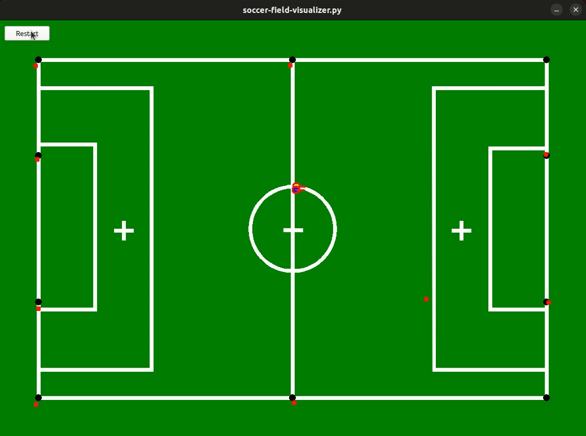

# mcl_sim: Soccer field landmark

mcl_simは、2次元平面上で仮想ロボットが円を描くように移動し, 自己位置推定を行うパッケージです。



## 概要

このパッケージは、モンテカルロローカライゼーション（MCL）アルゴリズムを使用して, ロボットの自己位置推定をシミュレートします.
ロボットは2次元平面上を移動し, センサーからの観測データを使用して自身の位置を推定します.
Soccer field のゴールポストや, コーナーなどのポールをランドマークとします.

## 特徴

- 仮想ロボットの移動シミュレーション
- MCLアルゴリズムによる自己位置推定
- PyQt5を使用した視覚化

## インストール

```sh
$ git clone git@github.com:IkuoShige/mcl_sim.git -b feat/probabilistic-robotics-report
$ cd mcl_sim
$ mkdir build
$ cmake ..
$ make
$ cd ../
$ uv sync
```

> **Note**
> uvのinstall
> ```sh
> $ curl -LsSf https://astral.sh/uv/install.sh | sh
> $ source $HOME/.cargo/env
> ```
> [公式ドキュメント](https://docs.astral.sh/uv/getting-started/installation/)を参照


## 使い方

`soccer-field-visualizer.py`を実行し, シミュレーションを開始.

```sh
$ uv run soccer-field-visualizer.py
```

## ライセンス

このプロジェクトはMITライセンスの下で公開されています。詳細については、LICENSEファイルを参照してください。
